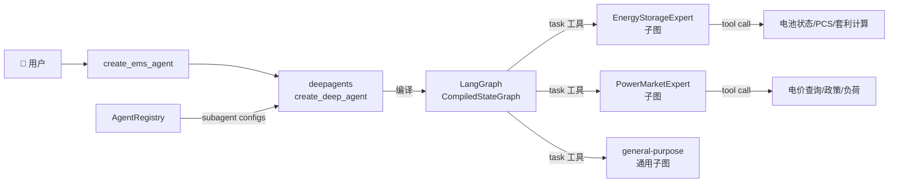

# ✅ 基于 deepagents 框架的 Agent 层架构 — 重构完成

## 设计原则

> **不重复实现 deepagents 已有能力，只做领域封装。**

## deepagents 提供的能力 vs 本层职责

| 能力 | deepagents 框架 | 本层（src/agents） |
|------|:---:|:---:|
| 任务规划 (write_todos) | ✅ 内置 | — |
| 文件操作 (read_file/write_file/ls/glob/grep) | ✅ 内置 | — |
| Shell 执行 (execute) | ✅ 内置 | — |
| Sub Agent 调度 (task 工具) | ✅ SubAgentMiddleware | — |
| 上下文自动摘要 | ✅ SummarizationMiddleware | — |
| Prompt 缓存 (Anthropic) | ✅ AnthropicPromptCachingMiddleware | — |
| Skills 系统 | ✅ SkillsMiddleware | — |
| 长期记忆 | ✅ MemoryMiddleware | — |
| Human-in-the-loop | ✅ HumanInTheLoopMiddleware | — |
| **领域 Agent 配置** | — | ✅ DomainAgent 基类 |
| **Agent 注册中心** | — | ✅ AgentRegistry |
| **EMS 系统提示词** | — | ✅ factory.py |
| **领域专用工具** | — | ✅ domains/*/tools/ |
| **领域专用提示词** | — | ✅ domains/*/prompts.py |

## 架构层次

```
┌─────────────────────────────────────────────┐
│              用户请求                         │
├─────────────────────────────────────────────┤
│         src/agents (本层)                    │
│  ┌─────────────────────────────────────┐    │
│  │  create_ems_agent()                 │    │
│  │  - 收集领域 Agent 配置              │    │
│  │  - 构建 EMS 系统提示词              │    │
│  │  - 调用 deepagents                  │    │
│  └────────────┬────────────────────────┘    │
│               │                              │
│  ┌────────────┴────────────────────────┐    │
│  │  AgentRegistry                      │    │
│  │  ┌──────────┐  ┌──────────────┐     │    │
│  │  │储能 Agent │  │ 电力 Agent   │     │    │
│  │  │(config)   │  │ (config)     │     │    │
│  │  └──────────┘  └──────────────┘     │    │
│  └─────────────────────────────────────┘    │
├─────────────────────────────────────────────┤
│         deepagents 框架（运行时）             │
│  ┌─────────────────────────────────────┐    │
│  │  create_deep_agent()                │    │
│  │  - 编译 SubAgent → LangGraph 子图   │    │
│  │  - 注入 task/write_todos/fs 工具    │    │
│  │  - 注入中间件栈                      │    │
│  │  - 自动摘要 / 上下文管理             │    │
│  └─────────────────────────────────────┘    │
├─────────────────────────────────────────────┤
│         LangGraph + LangChain (底层)         │
└─────────────────────────────────────────────┘
```

## 最终目录结构（精简后）

```
src/agents/
├── __init__.py                      # 包入口 (create_ems_agent + register_all_domains)
├── config/
│   └── settings.py                  # LLM 配置
├── core/                            # 核心封装层（3 个文件）
│   ├── domain_agent.py              # DomainAgent 基类（配置描述器）
│   ├── registry.py                  # AgentRegistry（收集配置 → deepagents SubAgent[]）
│   └── factory.py                   # create_ems_agent（→ deepagents create_deep_agent）
├── domains/                         # 领域 Agent 目录
│   ├── energy_storage/              # 储能 Agent
│   │   ├── agent.py                 # EnergyStorageAgent（DomainAgent 子类 + 自注册）
│   │   ├── prompts.py               # 领域提示词
│   │   └── tools/__init__.py        # 5 个领域专用工具
│   ├── power/                       # 电力 Agent
│   │   ├── agent.py                 # PowerMarketAgent（DomainAgent 子类 + 自注册）
│   │   ├── prompts.py               # 领域提示词
│   │   └── tools/__init__.py        # 5 个领域专用工具
│   └── _template/                   # 新 Agent 开发模板
├── tools/
│   └── system_tools.py              # 额外的公共工具（可选）
└── demo/
    └── multi_agent_demo.py          # 演示脚本
```

## 数据流



## 使用示例

```python
from src.agents import create_ems_agent, register_all_domains

# 1. 注册所有领域 Agent
register_all_domains()

# 2. 创建 EMS Lead Agent（deepagents CompiledStateGraph）
agent = create_ems_agent()

# 3. 执行 — deepagents 自动通过 task 工具调度领域 SubAgent
result = await agent.ainvoke({
    "messages": [("user", "调研广东省电价并制定储能充放电策略")]
})

# 4. 流式执行
async for step in agent.astream({
    "messages": [("user", "查看电池SOC状态")]
}):
    print(step)
```

## 扩展新领域

```python
# 1. 创建 domains/photovoltaic/agent.py
from src.agents.core.domain_agent import DomainAgent
from src.agents.core.registry import AgentRegistry

class PhotovoltaicAgent(DomainAgent):
    def __init__(self):
        super().__init__(
            name="PhotovoltaicExpert",
            description="光伏系统专家。负责发电预测、逆变器监控..."
        )
    
    def get_tools(self): return [inverter_status, power_forecast]
    def get_system_prompt(self): return "你是光伏专家..."

AgentRegistry.register(PhotovoltaicAgent())

# 2. 在 domains/__init__.py 添加导入
# 3. 完成 — deepagents 自动感知新 SubAgent
```

> [!IMPORTANT]
> [DomainAgent](file:///e:/EMS/ems-agent-flow/src/agents/core/domain_agent.py#31-167) 是纯配置描述器，不包含任何运行时逻辑。
> 所有运行时能力（任务调度、上下文隔离、中间件栈、Planning、文件操作）
> 全部由 deepagents 框架负责。
